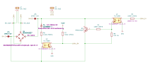
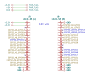

DALI PCB
========

Overview
--------

PCB to power and interface with DALI using an ESP32-S2 or ESP32-S3.

Usage
-----

This is a KiCad project.

Schematics
----------

Power for the DALI bus is optional and can be connected by populating the 0Ω
resistors.

.. image:: render/Root-sch.svg
   :alt: Root schematic

DALI
~~~~

There are 3 DALI bus connections.

Power
~~~~~

Power for the DALI bus is supplied by an external 12-22V DC power supply. Power
for the microcontroller is supplied by USB to the development board or an
external 5V DC power supply, with extra connections for powering other devices.

.. image:: render/Power-sch.svg
   :alt: Power (for DALI) schematic

Microcontroller
~~~~~~~~~~~~~~~

Supported development boards:

* LOLIN S3
* LOLIN S2 mini
* ESP32-DevKitC-1

Only one of these can be connected at a time.

I/O
~~~

Analogue and digital I/O pin headers are provided for integrations with external
switches and rotary encoders. There are multiple overlapping pin headers for
flexibility in how these are used. A pin header for FTDI UART connections is
provided but this only attached to the ESP32-S3 microcontrollers.

.. image:: render/IO-sch.svg
   :alt: I/O schematic

References
----------

* `Digitally Addressable Lighting Interface (DALI) Communication <https://ww1.microchip.com/downloads/en/AppNotes/01465A.pdf>`_

* `Digitally Addressable Lighting Interface (DALI) Unit Using the MC68HC908KX8 <https://www.nxp.com/docs/en/reference-manual/DRM004.pdf>`_

* `Digital Addressable Lighting Interface (DALI) Implementation Using MSP430 Value Line Microcontrollers <https://www.ti.com/lit/an/slaa422a/slaa422a.pdf>`_
