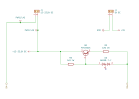
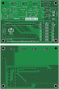

DALI PCB
========

Overview
--------

PCB to power and interface with DALI using an ESP32-S3.

Dimensions: 100mm W × 75mm H

Usage
-----

This is a KiCad project.

Schematics
----------

Power for the DALI bus is optional and can be connected using the solder jumper
bridges. If the power is supplied by this PCB then the polarity of the bus is
fixed so the bridge rectifier can be omitted.

.. image:: render/Root-sch.svg
   :alt: Root schematic

DALI
~~~~

There are 2 DALI bus connections.

.. image:: render/DALI-sch.svg
   :alt: DALI schematic

Power
~~~~~

Power for the DALI bus is supplied by an external 12-22V DC power supply. Power
for the microcontroller is supplied by USB to the development board or an
external 5V DC power supply.

Microcontroller
~~~~~~~~~~~~~~~

Connect a `LOLIN S3  <https://www.wemos.cc/en/latest/s3/s3.html>`_ development
board to the pin sockets.

.. image:: render/Microcontroller-sch.svg
   :alt: Microcontroller schematic

I/O
~~~

Analogue and digital I/O pin headers are provided for integrations with external
switches and rotary encoders.

The DALI bus also has a 3.3V direct pin header which can only be used when the
microcontroller is disconnected. This can't be used with a standard UART because
the DALI communication uses Manchester (bi-phase) encoding.

.. image:: render/IO-sch.svg
   :alt: I/O schematic

PCB
---

* Internal bus power: populate JP1-2, and populate either JP3-4 or D5
* External bus power: populate D5, do not populate JP1-4

Components
----------

+---------------------+----------+--------------------------------------------------------+
| Refs                | Quantity | Name                                                   |
+=====================+==========+========================================================+
|                     |     1    | LOLIN S3 Development Board                             |
+---------------------+----------+--------------------------------------------------------+
| D3                  |     1    | Diodes BAV99-7-F Dual Switching Diode, SOT-23-3        |
+---------------------+----------+--------------------------------------------------------+
| D4                  |     1    | Diodes DDZ9689S-7 Zener Diode, SOD-323                 |
+---------------------+----------+--------------------------------------------------------+
| D5                  |     1    | Infineon BGX50AE6327 Diode Bridge, SOT-143             |
+---------------------+----------+--------------------------------------------------------+
| J1, J2, J3, J4      |     4    | 1x02 Terminal Block, Through Hole (5.08mm)             |
+---------------------+----------+--------------------------------------------------------+
| J5, J6              |     2    | 1x20 Pin Socket, Through Hole (2.54mm)                 |
+---------------------+----------+--------------------------------------------------------+
| J7                  |     1    | 1x04 Pin Header, Through Hole (2.54mm)                 |
+---------------------+----------+--------------------------------------------------------+
| J8, J9              |     2    | 2x13 Pin Header, Through Hole (2.54mm)                 |
+---------------------+----------+--------------------------------------------------------+
| Q1                  |     1    | ON Semiconductor PZT2222AT1G NPN Transistor, SOT-223   |
+---------------------+----------+--------------------------------------------------------+
| Q2                  |     1    | ON Semiconductor MMBT2222ALT1G NPN Transistor, SOT-23  |
+---------------------+----------+--------------------------------------------------------+
| R2                  |     1    | 12Ω 1W Resistor, SMD 2512 (Metric 6332)                |
+---------------------+----------+--------------------------------------------------------+
| R3, R8              |     2    | 1kΩ 1W Resistor, SMD 2512 (Metric 6332)                |
+---------------------+----------+--------------------------------------------------------+
| R4                  |     1    | 120Ω 125mW Resistor, SMD 0805 (Metric 2012)            |
+---------------------+----------+--------------------------------------------------------+
| R5                  |     1    | 220Ω 125mW Resistor, SMD 0805 (Metric 2012)            |
+---------------------+----------+--------------------------------------------------------+
| R6                  |     1    | 2.2kΩ 250mW Resistor, SMD 1206 (Metric 3216)           |
+---------------------+----------+--------------------------------------------------------+
| R7                  |     1    | 10kΩ 125mW Resistor, SMD 0805 (Metric 2012)            |
+---------------------+----------+--------------------------------------------------------+
| U1, U2              |     2    | Vishay Semiconductors TCLT1000 Optocoupler, SOP-4L     |
+---------------------+----------+--------------------------------------------------------+

Total pin header count: 56

References
----------

* `Digitally Addressable Lighting Interface (DALI) Communication <https://ww1.microchip.com/downloads/en/AppNotes/01465A.pdf>`_

* `Digitally Addressable Lighting Interface (DALI) Unit Using the MC68HC908KX8 <https://www.nxp.com/docs/en/reference-manual/DRM004.pdf>`_

* `Digital Addressable Lighting Interface (DALI) Implementation Using MSP430 Value Line Microcontrollers <https://www.ti.com/lit/an/slaa422a/slaa422a.pdf>`_
