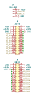

DALI PCB
========

Overview
--------

PCB to power and interface with DALI using an ESP32-S2 or ESP32-S3.

Dimensions: 180.5mm W × 113mm H × ~18mm D

Usage
-----

This is a KiCad project.

Schematics
----------

Power for the DALI bus is optional and can be connected using the solder jumper
bridges. If the power is supplied by this PCB then the polarity of the bus is
fixed so the bridge rectifier can be omitted.

.. image:: render/Root-sch.svg
   :alt: Root schematic

* Self-powered: populate JP1-2, and populate either JP3-4 or D5
* Bus-powered: populate D5, do not populate JP1-4

DALI
~~~~

There are 3 DALI bus connections.

.. image:: render/DALI-sch.svg
   :alt: DALI schematic

Power
~~~~~

Power for the DALI bus is supplied by an external 12-22V DC power supply. Power
for the microcontroller is supplied by USB to the development board or an
external 5V DC power supply, with extra connections for powering other devices.

.. image:: render/Power-sch.svg
   :alt: Power schematic

Microcontroller
~~~~~~~~~~~~~~~

Supported development boards:

* ESP32-DevKitC-1
* LOLIN S3
* LOLIN S3 mini
* LOLIN S2 mini

Only one of these can be connected at a time.

.. image:: render/Microcontroller-sch.svg
   :alt: Microcontroller schematic

I/O
~~~

Analogue and digital I/O pin headers are provided for integrations with external
switches and rotary encoders. There are multiple overlapping pin headers for
flexibility in how these are used.

A pin header for FTDI UART connections is provided but this only attached to the
ESP32-S3 microcontrollers. The DALI bus also has a 3.3V UART pin header which
can only be used when the microcontroller is disconnected.

PCB
---

.. image:: render/DALI-pcb.svg
   :alt: DALI PCB

References
----------

* `Digitally Addressable Lighting Interface (DALI) Communication <https://ww1.microchip.com/downloads/en/AppNotes/01465A.pdf>`_

* `Digitally Addressable Lighting Interface (DALI) Unit Using the MC68HC908KX8 <https://www.nxp.com/docs/en/reference-manual/DRM004.pdf>`_

* `Digital Addressable Lighting Interface (DALI) Implementation Using MSP430 Value Line Microcontrollers <https://www.ti.com/lit/an/slaa422a/slaa422a.pdf>`_
